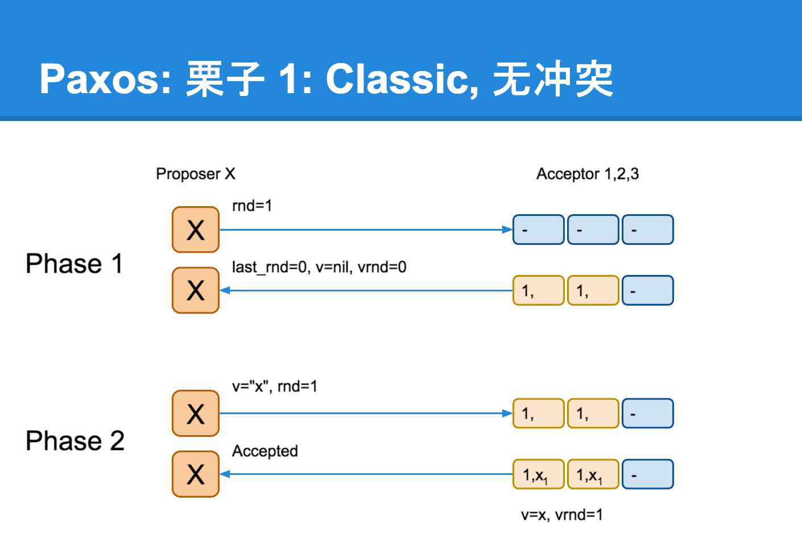
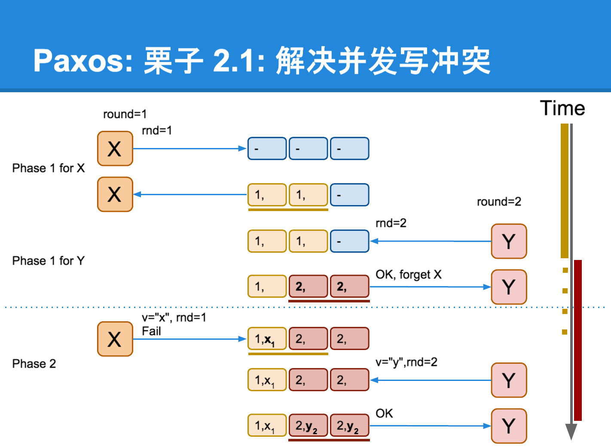
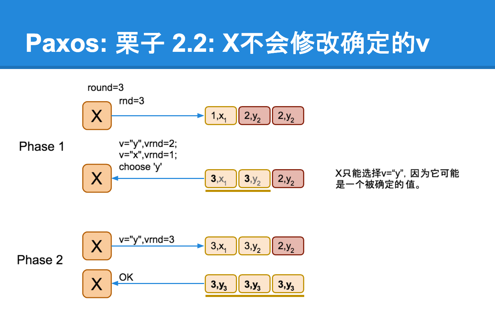

# paxos 算法

以前学习的笔记：[paxos学习](paxos学习.md)

本文主要摘自: [Paxos算法原理与推导](http://linbingdong.com/2017/04/17/%E5%88%86%E5%B8%83%E5%BC%8F%E7%B3%BB%E5%88%97%E6%96%87%E7%AB%A0%E2%80%94%E2%80%94Paxos%E7%AE%97%E6%B3%95%E5%8E%9F%E7%90%86%E4%B8%8E%E6%8E%A8%E5%AF%BC/)

- [简介](#%E7%AE%80%E4%BB%8B)
    - [相关概念](#%E7%9B%B8%E5%85%B3%E6%A6%82%E5%BF%B5)
    - [目标](#%E7%9B%AE%E6%A0%87)
    - [基本设定](#%E5%9F%BA%E6%9C%AC%E8%AE%BE%E5%AE%9A)
- [算法推导](#%E7%AE%97%E6%B3%95%E6%8E%A8%E5%AF%BC)
    - [最简单的方案——只有一个Acceptor](#%E6%9C%80%E7%AE%80%E5%8D%95%E7%9A%84%E6%96%B9%E6%A1%88%E2%80%94%E2%80%94%E5%8F%AA%E6%9C%89%E4%B8%80%E4%B8%AAacceptor)
    - [多个 Acceptors](#%E5%A4%9A%E4%B8%AA-acceptors)
        - [情况 1](#%E6%83%85%E5%86%B5-1)
        - [情况2](#%E6%83%85%E5%86%B52)
        - [Proposer生成提案](#proposer%E7%94%9F%E6%88%90%E6%8F%90%E6%A1%88)
        - [Acceptor接受提案](#acceptor%E6%8E%A5%E5%8F%97%E6%8F%90%E6%A1%88)
    - [算法描述](#%E7%AE%97%E6%B3%95%E6%8F%8F%E8%BF%B0)
        - [举例](#%E4%B8%BE%E4%BE%8B)
        - [Learner学习被选定的value](#learner%E5%AD%A6%E4%B9%A0%E8%A2%AB%E9%80%89%E5%AE%9A%E7%9A%84value)
- [活性的保证](#%E6%B4%BB%E6%80%A7%E7%9A%84%E4%BF%9D%E8%AF%81)
- [变种](#%E5%8F%98%E7%A7%8D)
- [应用](#%E5%BA%94%E7%94%A8)
- [参考](#%E5%8F%82%E8%80%83)

## 简介

> Paxos算法是基于**消息传递**且具有**高度容错特性**的**一致性算法**，是目前公认的解决**分布式一致性**问题**最有效**的算法之一。

### 相关概念

在Paxos算法中，有三种角色：

- **Proposer**：提出提案，提案信息包括提案编号和提议的value
- **Acceptor**：收到提案后可以接受（accept）提案，若提案获得多数acceptors的接受，则称该提案被批准（chosen）
- **Learners**: 只能“学习”被批准的提案

在具体的实现中，一个进程可能**同时充当多种角色**。比如一个进程可能**既是Proposer又是Acceptor又是Learner**。

### 目标

Paxos的目标：保证最终有一个value会被选定，当value被选定后，进程最终也能获取到被选定的value。

### 基本设定

假设不同角色之间可以通过发送消息来进行通信，那么：

- 每个角色以任意的速度执行，可能因出错而停止，也可能会重启。一个value被选定后，所有的角色可能失败然后重启，除非那些失败后重启的角色能记录某些信息(后续提到的接受最大编号的提案及其对应的值)，否则等他们重启后无法确定被选定的值。
- 消息在传递过程中可能出现任意时长的延迟，可能会重复，也可能丢失。但是消息不会被损坏，即消息内容不会被篡改（拜占庭将军问题）。

换句话来说，paxos 有如下设定：

* 存储 `必须` 是可靠的
* 能够 `容忍` 消息的丢失和乱序，但不可篡改

## 算法推导

### 最简单的方案——只有一个Acceptor

假设只有一个Acceptor（可以有多个Proposer），只要Acceptor接受它收到的第一个提案，则该提案被选定，该提案里的value就是被选定的value。这样就保证只有一个value会被选定。

因此必须要有多个 Acceptors

### 多个 Acceptors

#### 情况 1

希望即使只有一个Proposer提出了一个value，该value也最终被选定，就需要满足 `P1` 约束:

> P1：一个Acceptor必须接受它收到的第一个提案。

#### 情况2

所以需要进一步规定:

 > 一个提案被选定需要被**半数以上**的Acceptors接受

同时为了保证只有一个 `Value` 被选定，就需要满足 `P2` 约束:

> P2：如果某个 value为 v的提案被选定了，那么每个编号更高的被选定提案的 value 必须也是 v。

一个提案只有被Acceptor接受才可能被选定，因此我们可以把 `P2` 约束改写成对Acceptor接受的提案的约束 `P2a`:

> P2a：如果某个 value 为 v 的提案被选定了，那么每个编号更高的被Acceptor接受的提案的 value 必须也是 v。

但是，会有这种情况出现：

假设总的有5个Acceptor。Proposer2提出`[M1,V1]`的提案，Acceptor2~5（半数以上）均接受了该提案，于是对于Acceptor2~5和Proposer2来讲，它们都认为V1被选定。**Acceptor1刚刚从宕机状态恢复过来（之前Acceptor1没有收到过任何提案），此时Proposer1向Acceptor1发送了`[M2,V2]`的提案（V2≠V1且M2>M1），对于Acceptor1来讲，这是它收到的第一个提案。**根据`P1`（一个Acceptor必须接受它收到的第一个提案。）,Acceptor1必须接受该提案！同时Acceptor1认为V2被选定。

所以我们要对 `P2a` 约束进行强化: 

`P2a`是对 `Acceptor` 接受的提案约束，但其实提案是Proposer提出来的，所有我们可以对`Proposer`提出的提案进行约束。得到 `P2b`:

> P2b：如果某个value为v的提案被选定了，那么之后任何Proposer提出的编号更高的提案的value必须也是v。

由 `P2b` 可以推出 `P2a` 进而推出 `P2`：

> 对比发现： `P2b` ==> `P2a` ==> `P2`，简单说来就是从源头控制了 value 的一致)
>
> P2：如果某个 value为 v的提案被选定了，那么每个编号更高的被选定提案的 value 必须也是 v。
>
> P2a：如果某个 value 为 v 的提案被选定了，那么每个编号更高的被Acceptor接受的提案的 value 必须也是 v。
>
> P2b：如果某个value为v的提案被选定了，那么之后任何Proposer提出的编号更高的提案的value必须也是v。

那么，如何确保在某个 value 为 v 的提案被选定后，Proposer 提出的编号更高的提案的value都是v呢？只要满足 `P2c` 即可(可以用数学归纳法证明`P2c`蕴涵`P2b`)：

> P2c：如果一个编号为 N 的提案具有 value V，那么存在一个多数派(一个半数以上的Acceptor组成的集合S，满足以下两个条件中的任意一个)
>
> * S中每个 Acceptor 都没有接受过编号小于 N 的提案。
> * S中 Acceptor 接受过的最大编号的提案的 value为 V。

#### Proposer生成提案

要满足P2c的约束，proposer提出一个提案前先要 **学习** 已经被选定或可能被选定的 Value，然后以该value作为自己提出的提案的value。如果没有value被选定，Proposer才可以自己决定value的值，形成提案。当获得多数acceptors接受（accept）后，提案获得批准（chosen），由 proposer 将这个消息告知 learner。这个简略的过程经过进一步细化后就形成了Paxos算法。

##### 提案生成算法

1. Proposer选择一个**新的提案编号N**，然后向**某个Acceptor集合**（半数以上）发送请求，要求该集合中的每个Acceptor做出如下响应（response）。
   (a) 向Proposer承诺保证**不再接受**任何编号**小于N的提案**。
   (b) 如果Acceptor已经接受过提案，那么就向Proposer响应**已经接受过**的编号小于N的**最大编号的提案**。

   我们将该请求称为**编号为N**的**Prepare请求**。

2. 如果Proposer收到了**半数以上**的Acceptor的**响应**，那么它就可以生成编号为N，Value为V的**提案[N,V]**。这里的V是所有的响应中**编号最大的提案的Value**。如果所有的响应中**都没有提案**，那 么此时V就可以由Proposer**自己选择**。
   生成提案后，Proposer将该**提案**发送给**半数以上**的Acceptor集合，并期望这些Acceptor能接受该提案。（注意：此时接受Accept请求的Acceptor集合**不一定**是之前响应Prepare请求的Acceptor集合）

   我们称该请求为**Accept请求**。

#### Acceptor接受提案

* Acceptor **可以忽略任何请求**（包括Prepare请求和Accept请求）而不用担心破坏算法的**安全性** (An acceptor can ignore any request without compromising safety.)

什么情况下不忽略? 对Acceptor接受提案 给出 `P1a` 约束:

> 对比 P1a 和 P1
>
> P1a：一个Acceptor只要尚**未响应过**任何**编号大于N**的**Prepare请求**，那么他就可以**接受**这个**编号为N的提案**。
>
> 对比 P1:
>
> P1：一个Acceptor必须接受它收到的第一个提案。

因此，一个Acceptor**只需记住**：

1. 已接受的编号最大的提案 
2. 已响应的请求的最大编号。

### 算法描述

将 Proposer 生成提案和 Acceptor 接受提案结合起来就是 `Paxos算法`。分为**两个阶段**。具体如下：

- **阶段一：**

  (a) Proposer选择一个**提案编号N**，然后向**半数以上**的Acceptor发送编号为N的**Prepare请求**。

  (b) 如果一个Acceptor收到一个编号为N的Prepare请求，且N**大于**该Acceptor已经**响应过的**所有**Prepare请求**的编号，那么它就会将它已经**接受过的编号最大的提案（如果有的话）**作为响应反馈给Proposer，同时该Acceptor承诺**不再接受**任何**编号小于N的提案**。

- **阶段二：**

  (a) 如果Proposer收到**半数以上**Acceptor对其发出的编号为N的Prepare请求的**响应**，那么它就会发送一个针对**[N,V]提案**的**Accept请求**给**半数以上**的Acceptor。注意：V就是收到的**响应**中**编号最大的提案的value**，如果响应中**不包含任何提案**，那么V就由Proposer**自己决定**。

  (b) 如果Acceptor收到一个针对编号为N的提案的Accept请求，只要该Acceptor**没有**对编号**大于N**的**Prepare请求**做出过**响应**，它就**接受该提案**。

#### 举例

#### Learner学习被选定的value

## 活性的保证

但是由于消息传递的不确定性，可能有多个proposer自认为自己已经成为leader。Lamport在[The Part-Time Parliament](http://research.microsoft.com/users/lamport/pubs/lamport-paxos.pdf)一文中描述并解决了这个问题。

## 变种

* [multi-paxos](https://en.wikipedia.org/wiki/Paxos_(computer_science)#Multi-Paxos)
* [cheap paxos](https://en.wikipedia.org/wiki/Paxos_(computer_science)#Cheap_Paxos)
* [fast paxos](https://en.wikipedia.org/wiki/Paxos_(computer_science)#Fast_Paxos)
* [byzantine paxos](https://en.wikipedia.org/wiki/Paxos_(computer_science)#Byzantine_Paxos)
* [...](https://en.wikipedia.org/wiki/Paxos_(computer_science))

## 应用

* [chubby lock](https://research.google.com/archive/chubby.html)
* [zookeeper](https://zookeeper.apache.org/)
* [megastore](https://research.google.com/pubs/pub36971.html)
* [spanner](https://research.google.com/archive/spanner.html)

## 参考

* [Paxos Made Simple](http://lamport.azurewebsites.net/pubs/paxos-simple.pdf) 注：Lamport觉得同行无法接受他的幽默感，于是用容易接受的方法重新表述了一遍
* 最初版: [The Part-Time Parliament](http://research.microsoft.com/users/lamport/pubs/lamport-paxos.pdf) 注: Lamport虚拟了一个叫做Paxos的希腊城邦
* 维基百科中英词条：[Paxos算法](https://zh.wikipedia.org/wiki/Paxos%E7%AE%97%E6%B3%95) 和 [Paxos_computer science](https://en.wikipedia.org/wiki/Paxos_(computer_science))
* [Paxos算法原理与推导](http://linbingdong.com/2017/04/17/%E5%88%86%E5%B8%83%E5%BC%8F%E7%B3%BB%E5%88%97%E6%96%87%E7%AB%A0%E2%80%94%E2%80%94Paxos%E7%AE%97%E6%B3%95%E5%8E%9F%E7%90%86%E4%B8%8E%E6%8E%A8%E5%AF%BC/)
* [Paxos算法实现](http://linbingdong.com/2017/11/21/PhxPaxos%E6%BA%90%E7%A0%81%E5%88%86%E6%9E%90%E2%80%94%E2%80%94Paxos%E7%AE%97%E6%B3%95%E5%AE%9E%E7%8E%B0/)
* [paxos的直观解释](http://drmingdrmer.github.io/tech/distributed/2015/11/11/paxos-slide.html)